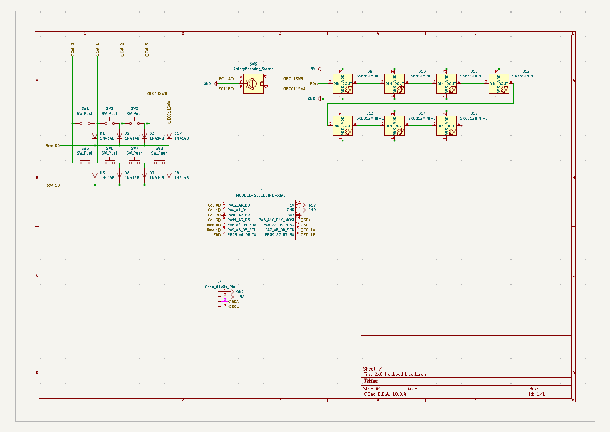

# RhythmPad

RhythmPad is a 2x8 macro pad that includes 7 key switches, a rotary encoder switch, an OLED display, and 7 SK6812MINI-E LEDs. I created the case on Onshape and used QMK firmware. The macropad serves to function as a rhythm game pad but also a soundboard as well.

***
## Features
- 7 MX-style key switches
- 1 EC11 rotary encoder switch
- 1 0.91 inch OLED display
- 7 SK6812MINI-E LEDs
- 2 layer case attached with 4 M3x16mm screws and 4 M3x5mx4mm heatset inserts

***
## Schematic

