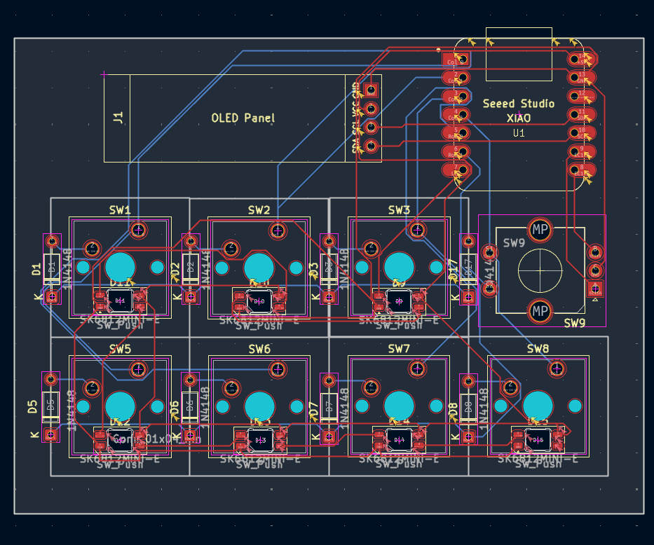
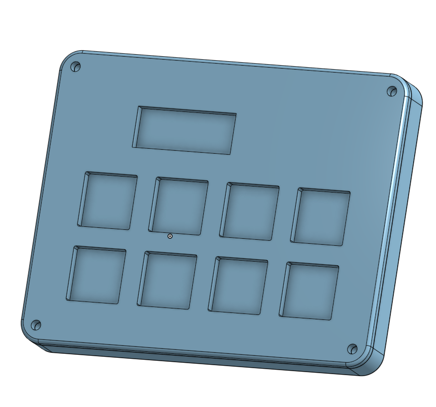

# RhythmPad
***
RhythmPad is a 2x8 macro pad that includes 7 key switches, a rotary encoder switch, an OLED display, and 7 SK6812MINI-E LEDs. I created the case on Onshape and used QMK firmware. The macropad serves to function as a rhythm game pad but also a soundboard as well.

## Features
***
- 7 MX-style key switches
- 1 EC11 rotary encoder switch
- 1 0.91 inch OLED display
- 7 SK6812MINI-E LEDs
- 2 layer case attached with 4 M3x16mm screws and 4 M3x5mx4mm heatset inserts

## Schematic
***
The schematic was made in KiCad and features a switch matrix to lessen the amount of pins the switches take up.

## PCB
***
The pcb was difficult to wire and had many errors due to the LEDS. I probably should've had better placements before wiring.

## CAD
***
The case was designed in OnShape and uses the 4 M3x16mm screws and 4 M3x5mx4mm heatset inserts. It was hard to import the switch blueprint to make sure each square had enough space. It was also time-consuming to constantly switch between the pcb in KiCad and Onshape to measure each dimension to make sure it fit.

## Firmware
***
This was the hardest part as QMK needed its environment to be downloaded which took a lot of time. It was also really confusing to work through the keyboard, config, and rules files but it worked in the end.

## BOM
***
- 1 Seeed XIAO RP2040
- 8x 1N4148 Diodes
- 7x MX-Style switches
- 1x EC11 Rotary encoders
- 1x 0.91 inch OLED display 
- 7x white blank DSA keycaps
- 7x SK6812 MINI-E LEDs
- 4x M3x16mm screws
- 4x M3x5mx4mm heatset inserts
- 1x Case (Top layer and bottom layer)
- 1x PCB (Custom-made)
